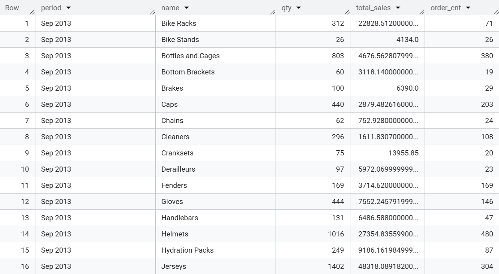
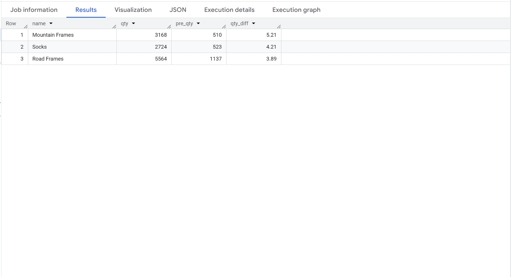
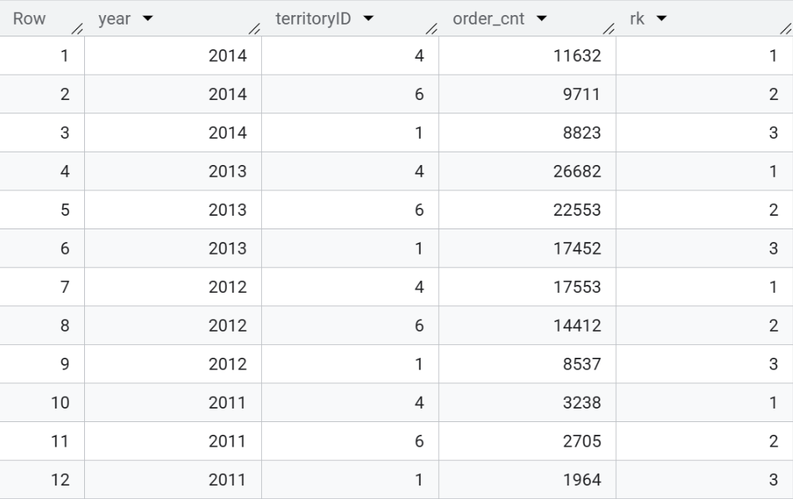
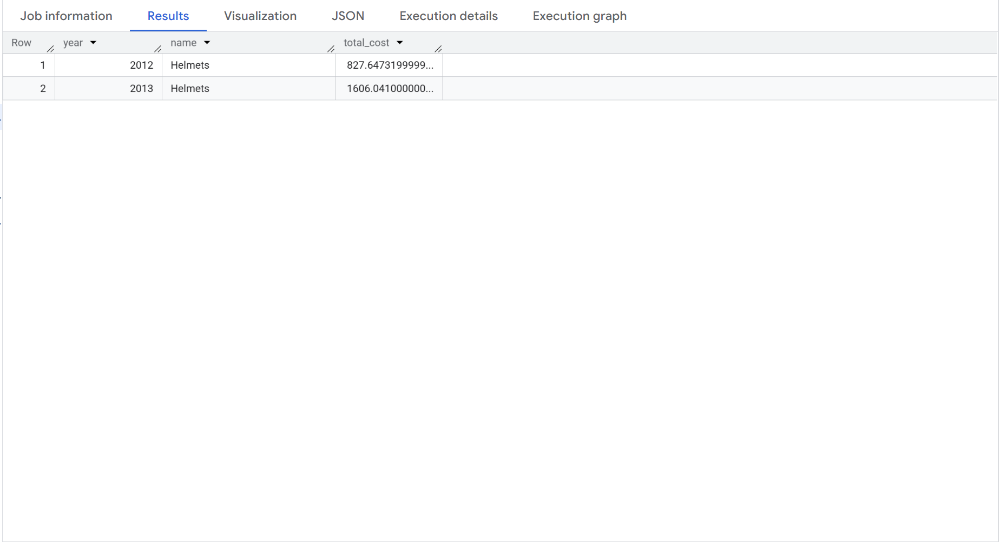
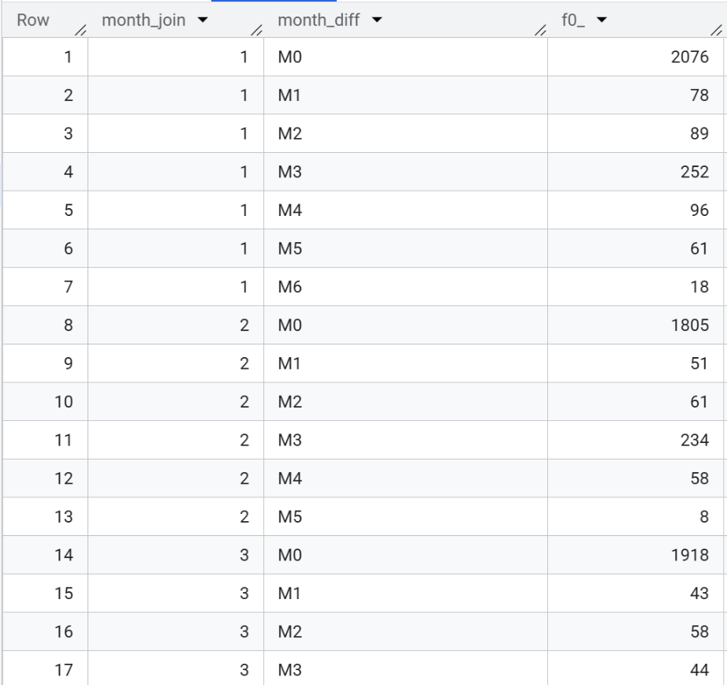
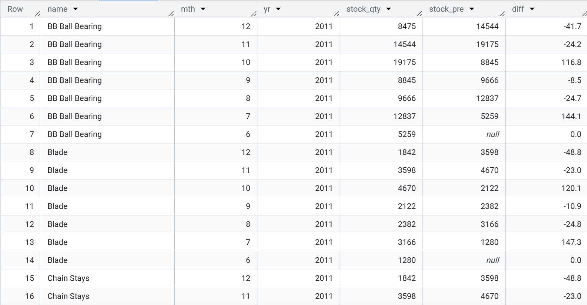
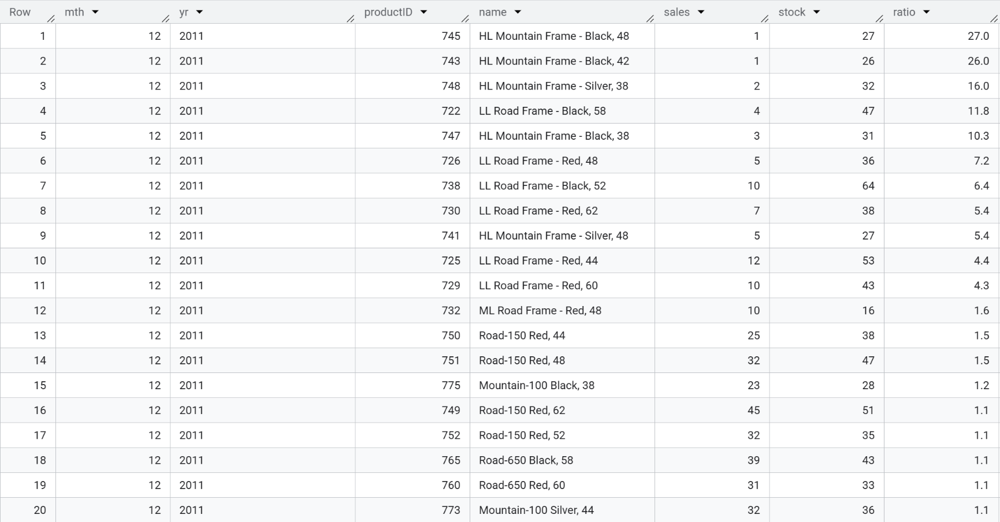
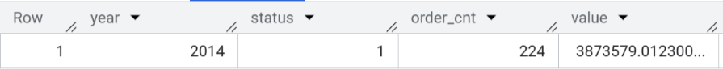

# AdventureWorks Sales & Inventory Analysis with BigQuery


All 8 queries below have been executed and validated directly in Google BigQuery. You can view the live project (queries, execution, and saved results) here:

👉 **[Open in BigQuery Console](https://console.cloud.google.com/bigquery?ws=!1m7!1m6!12m5!1m3!1suni-sql-project-1!2sus-central1!3s52278554-753e-4a60-bf9e-de9c63bb4ddd!2e1)**

---

## 📁 Project Overview

| | |
|---|---|
| **Dataset** | [AdventureWorks 2019](https://learn.microsoft.com/en-us/sql/samples/adventureworks-install-configure) — Microsoft's sample dataset simulating a bicycle manufacturing & distribution company (Sales, Production, Purchasing, HR schemas) |
| **Tool** | Google BigQuery (Standard SQL) |
| **Time period analyzed** | 2011 – 2014 (varies by query, see below) |
| **Focus areas** | Sales performance by category, YoY growth, territory ranking, discount/promotion cost, customer cohort retention, inventory (stock) trends, stock-to-sales efficiency, purchase order backlog |
| **Techniques used** | Window functions (`LAG`, `RANK`, `MIN() OVER`), CTEs (`WITH`), multi-table `INNER`/`LEFT JOIN`, cohort analysis pattern, conditional/date functions (`EXTRACT`, `DATE_DIFF`, `FORMAT_DATE`), `IFNULL` null-handling, ratio & growth-rate calculations |

### Why this dataset?

AdventureWorks is one of the most widely used **relational, multi-table business datasets** for analytics practice — it mirrors a real OLTP schema (separate Sales, Production, and Purchasing schemas with proper foreign keys) rather than one flat table. Working with it means writing SQL the way it's actually written in a company's data warehouse: **joining across normalized tables**, not just filtering a single spreadsheet-like source.

---

## 🎯 Business Questions & Key Findings

### Query 01 — Units Sold, Sales Value & Order Count by Subcategory (Last 12 Months)

**Query:**
```sql
SELECT format_date('%b %Y', sale.ModifiedDate) as period
      ,subprd.Name as name
      ,SUM(OrderQty) as qty
      ,SUM(LineTotal) as total_sales
      ,COUNT(DISTINCT SalesOrderID) as order_cnt
FROM adventureworks2019.Production.Product as prd
INNER JOIN adventureworks2019.Production.ProductSubcategory as subprd
  ON CAST(subprd.ProductSubcategoryID as STRING) = prd.ProductSubcategoryID
INNER JOIN adventureworks2019.Sales.SalesOrderDetail as sale USING (ProductID)
WHERE (
  DATE_DIFF(DATE((SELECT MAX(ModifiedDate) FROM adventureworks2019.Sales.SalesOrderDetail))
  ,DATE(sale.ModifiedDate)
  ,MONTH) <= 12
)
GROUP BY 1,2
ORDER BY 1 DESC,2;
```

**Result:**



---

### Query 02 — Top 3 Subcategories by YoY Growth Rate

**Query:**
```sql
WITH year_pre AS
  (SELECT subprd.Name as name
        ,EXTRACT(YEAR FROM sale.ModifiedDate) as year
        ,SUM(OrderQty) as qty
  FROM adventureworks2019.Production.Product as prd
  INNER JOIN adventureworks2019.Sales.SalesOrderDetail as sale
    USING (ProductID)
  INNER JOIN adventureworks2019.Production.ProductSubcategory as subprd
    ON CAST(subprd.ProductSubcategoryID as STRING) = prd.ProductSubcategoryID
  GROUP BY 1,2)

SELECT name
      ,qty
      ,pre_qty
      ,ROUND((qty - pre_qty) / pre_qty, 2) as qty_diff
FROM
  (SELECT *
        ,LAG(qty) OVER (PARTITION BY name ORDER BY year) as pre_qty
  FROM year_pre) as pre_out
ORDER BY 4 DESC
LIMIT 3;
```

**Result:**



---

### Query 03 — Top 3 Territories by Order Quantity, Every Year

**Query:**
```sql
WITH year_rk AS
  (SELECT EXTRACT(YEAR FROM detail.ModifiedDate) as year
        ,head.TerritoryID as territoryID
        ,SUM(OrderQty) as order_cnt
  FROM adventureworks2019.Sales.SalesOrderHeader as head
  INNER JOIN adventureworks2019.Sales.SalesOrderDetail as detail
    USING (SalesOrderID)
  GROUP BY 1,2)

SELECT *
FROM
  (SELECT *
        ,RANK() OVER (PARTITION BY year ORDER BY order_cnt DESC) as rk
  FROM year_rk) as rk_out
WHERE rk IN (1,2,3)
ORDER BY 1 DESC, 4;
```

**Result:**



---

### Query 04 — Seasonal Discount Cost by Subcategory

**Query:**
```sql
SELECT EXTRACT(YEAR FROM sale.ModifiedDate) as year
      ,subprd.Name as name
      ,SUM((UnitPrice * OrderQty) - LineTotal) as total_cost
FROM adventureworks2019.Production.Product as prd
INNER JOIN adventureworks2019.Production.ProductSubcategory as subprd
  ON CAST(subprd.ProductSubcategoryID as STRING) = prd.ProductSubcategoryID
INNER JOIN adventureworks2019.Sales.SalesOrderDetail as sale
  USING (ProductID)
INNER JOIN adventureworks2019.Sales.SpecialOffer as special
  USING (SpecialOfferID)
WHERE type LIKE '%Seasonal Discount%'
GROUP BY 1,2
ORDER BY 2,3;
```

**Result:**



---

### Query 05 — Customer Retention Cohort Analysis (2014, Shipped Orders)

**Query:**
```sql
WITH diff_gr AS
  (SELECT *
        ,month - month_join as diff
  FROM
      (SELECT CustomerID
            ,MIN(EXTRACT(MONTH FROM ModifiedDate)) OVER (PARTITION BY CustomerID ORDER BY ModifiedDate) as month_join
            ,EXTRACT(MONTH FROM ModifiedDate) as month
      FROM adventureworks2019.Sales.SalesOrderHeader
      WHERE EXTRACT(YEAR FROM ModifiedDate) = 2014
            AND Status = 5) as month_diff)

SELECT month_join
      ,CONCAT('M', diff) as month_diff
      ,COUNT(DISTINCT CustomerID)
FROM diff_gr
GROUP BY month_join, month_diff
ORDER BY 1,2;
```

**Result:**



---

### Query 06 — Stock Level Trend & MoM % Change (2011, All Products)

**Query:**
```sql
WITH stock_pre AS
  (SELECT prd.Name as name
        ,EXTRACT(MONTH FROM stock.ModifiedDate) as mth
        ,EXTRACT(YEAR FROM stock.ModifiedDate) as yr
        ,SUM(StockedQty) as stock_qty
  FROM adventureworks2019.Production.WorkOrder as stock
  INNER JOIN adventureworks2019.Production.Product as prd
    USING (ProductID)
  WHERE EXTRACT(YEAR FROM stock.ModifiedDate) = 2011
  GROUP BY 1,2,3)

SELECT *
      ,IFNULL(ROUND(100 * (stock_qty - stock_pre) / stock_pre, 1), 0) as diff
FROM
  (SELECT *
        ,LAG(stock_qty) OVER (PARTITION BY name ORDER BY mth) as stock_pre
  FROM stock_pre) as pre_out
ORDER BY 1, 2 DESC;
```

**Result:**



---

### Query 07 — Stock-to-Sales Ratio (2011, by Product, by Month)

**Query:**
```sql
WITH stock_join AS
  (SELECT ProductID
          ,EXTRACT(MONTH FROM ModifiedDate) as mth
          ,SUM(StockedQty) as stock
    FROM adventureworks2019.Production.WorkOrder
    WHERE EXTRACT(YEAR FROM ModifiedDate) = 2011
    GROUP BY 1,2),

sale_join AS
  (SELECT ProductID
          ,EXTRACT(MONTH FROM ModifiedDate) as mth
          ,SUM(OrderQty) as sales
    FROM adventureworks2019.Sales.SalesOrderDetail
    WHERE EXTRACT(YEAR FROM ModifiedDate) = 2011
    GROUP BY 1,2)

SELECT sale_join.mth
      ,'2011' as yr
      ,prd.ProductID as productID
      ,prd.Name as name
      ,sales
      ,stock
      ,ROUND(stock / sales, 1) as ratio
FROM stock_join
LEFT JOIN sale_join
  ON sale_join.ProductID = stock_join.ProductID
  AND sale_join.mth = stock_join.mth
LEFT JOIN adventureworks2019.Production.Product as prd
  ON stock_join.ProductID = prd.ProductID
ORDER BY 1 DESC, 7 DESC;
```

**Result:**



---

### Query 08 — Pending Purchase Orders (2014)

**Query:**
```sql
SELECT EXTRACT(YEAR FROM ModifiedDate) as year
      ,1 as status
      ,COUNT(DISTINCT PurchaseOrderID) as order_cnt
      ,SUM(TotalDue) as value
FROM adventureworks2019.Purchasing.PurchaseOrderHeader
WHERE Status = 1
      AND EXTRACT(YEAR FROM ModifiedDate) = 2014
GROUP BY 1,2;
```

**Result:**



---

## 🧠 Summary of Key Business Insights

1. **Volume ≠ value**: high-order-count subcategories (Bottles and Cages) and high-order-value subcategories (Cranksets) require different pricing/merchandising strategies.
2. **Growth was frame-led, not accessory-led**: Mountain Frames and Road Frames both landed in the top-3 YoY growth list, pointing to core-product strength rather than just accessory upsell.
3. **Territory 4 is a stable #1 performer** across 4 straight years, but 2014 shows a sharp drop from the 2013 peak — worth root-cause investigation.
4. **A ~quarterly repurchase pattern (M3 spike)** shows up in the cohort data — a concrete signal for timing re-engagement campaigns.
5. **Inventory is uneven**: some lines (HL Mountain Frame) are wildly overstocked relative to sales, while others turn over efficiently — a clear opportunity for inventory rebalancing.

---

## 🛠️ Skills Demonstrated

- **Window functions** (`LAG`, `RANK`, `MIN() OVER (PARTITION BY ...)`) for period-over-period comparisons, ranking, and cohort logic
- **CTEs** for readable, modular multi-step logic (`WITH ... AS`)
- Multi-table **JOINs** across a normalized, real-world relational schema (Sales / Production / Purchasing)
- **Cohort / retention analysis** pattern — a common growth & marketing analytics technique
- Date functions (`EXTRACT`, `DATE_DIFF`, `FORMAT_DATE`) and safe null-handling (`IFNULL`)
- Translating raw query output into **business insights and recommendations**, not just numbers
- Working with Google Cloud Platform / BigQuery console end-to-end
